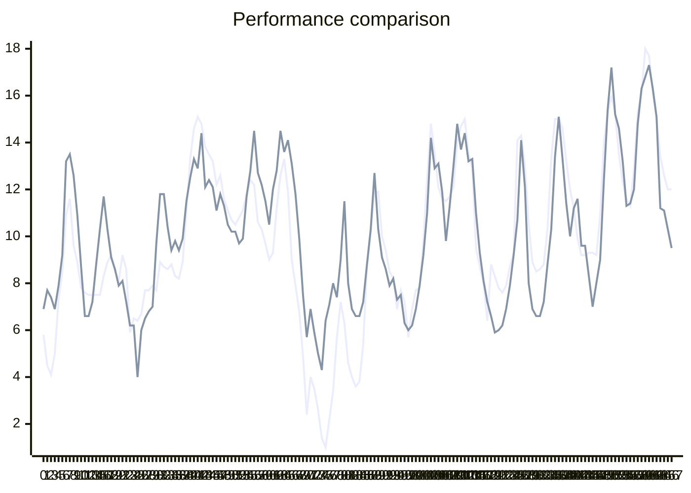

This compares the actual prices to the ones returned by the model for a random 1 week time period.

```mermaid
xychart-beta
    title "Performance comparison"
    x-axis [0,1,2,3,4,5,6,7,8,9,10,11,12,13,14,15,16,17,18,19,20,21,22,23,24,25,26,27,28,29,30,31,32,33,34,35,36,37,38,39,40,41,42,43,44,45,46,47,48,49,50,51,52,53,54,55,56,57,58,59,60,61,62,63,64,65,66,67,68,69,70,71,72,73,74,75,76,77,78,79,80,81,82,83,84,85,86,87,88,89,90,91,92,93,94,95,96,97,98,99,100,101,102,103,104,105,106,107,108,109,110,111,112,113,114,115,116,117,118,119,120,121,122,123,124,125,126,127,128,129,130,131,132,133,134,135,136,137,138,139,140,141,142,143,144,145,146,147,148,149,150,151,152,153,154,155,156,157,158,159,160,161,162,163,164,165,166,167]
    line [5.8,4.5,4.1,5.0,7.3,8.5,10.9,11.6,9.6,8.9,7.8,7.6,7.5,7.5,7.5,7.5,8.3,8.9,9.2,8.5,8.1,9.2,8.6,5.9,6.5,6.4,6.7,7.7,7.7,7.9,7.7,8.9,8.7,8.6,8.8,8.3,8.2,8.9,11.1,13.3,14.6,15.1,14.8,13.8,13.5,13.2,12.2,12.6,11.6,11.1,10.7,10.5,10.8,11.1,11.8,12.4,12.2,10.6,10.3,9.7,9.0,9.3,11.2,12.6,13.3,11.9,9.0,7.9,6.8,4.9,2.4,4.0,3.5,2.6,1.4,1.0,2.2,3.4,5.7,7.2,6.3,4.6,4.0,3.6,3.8,5.4,8.7,10.2,11.9,11.9,10.0,9.4,8.5,8.2,6.9,7.7,7.2,5.7,6.9,7.7,7.8,9.8,12.5,14.8,13.5,12.1,11.6,11.5,11.7,12.1,14.0,14.7,15.0,13.5,12.9,9.5,8.7,8.0,6.4,8.8,8.3,7.8,7.6,7.9,8.7,9.3,14.1,14.3,13.0,10.5,8.9,8.5,8.6,8.8,10.3,13.3,15.0,15.0,14.6,13.2,12.0,11.2,9.9,9.2,9.2,9.3,9.3,9.2,10.9,14.0,15.3,16.0,15.2,13.5,12.3,11.6,11.3,12.9,15.3,16.1,18.0,17.7,16.1,15.0,13.4,12.6,12.0,12.0]
    line [6.9,7.7,7.4,6.9,7.9,9.2,13.2,13.5,12.6,10.9,8.7,6.6,6.6,7.2,8.8,10.3,11.7,10.3,9.1,8.6,7.9,8.1,7.2,6.2,6.2,4.0,6.0,6.5,6.8,7.0,9.7,11.8,11.8,10.4,9.4,9.8,9.4,9.9,11.5,12.5,13.3,12.9,14.4,12.1,12.4,12.1,11.1,11.8,11.3,10.5,10.2,10.2,9.7,9.9,11.7,12.8,14.5,12.7,12.2,11.5,10.5,12.0,12.8,14.5,13.6,14.1,13.1,11.8,9.9,7.5,5.7,6.9,5.9,5.0,4.3,6.4,7.1,8.0,7.4,9.0,11.5,8.0,6.9,6.6,6.6,7.2,8.8,10.3,12.7,10.3,9.1,8.6,7.9,8.2,7.3,7.5,6.3,6.0,6.2,6.9,7.9,9.2,11.0,14.2,12.9,13.1,11.9,9.8,11.3,13.0,14.8,13.7,14.4,13.2,13.3,11.0,9.3,8.1,7.2,6.6,5.9,6.0,6.2,6.9,7.9,9.2,10.7,14.1,12.1,8.0,6.9,6.6,6.6,7.2,8.8,10.3,13.4,15.1,13.3,11.4,10.0,11.2,11.6,9.6,9.6,8.3,7.0,8.0,9.0,12.4,15.4,17.2,15.2,14.6,13.2,11.3,11.4,12.0,14.8,16.3,16.8,17.3,16.3,15.1,11.2,11.1,10.3,9.5]
```