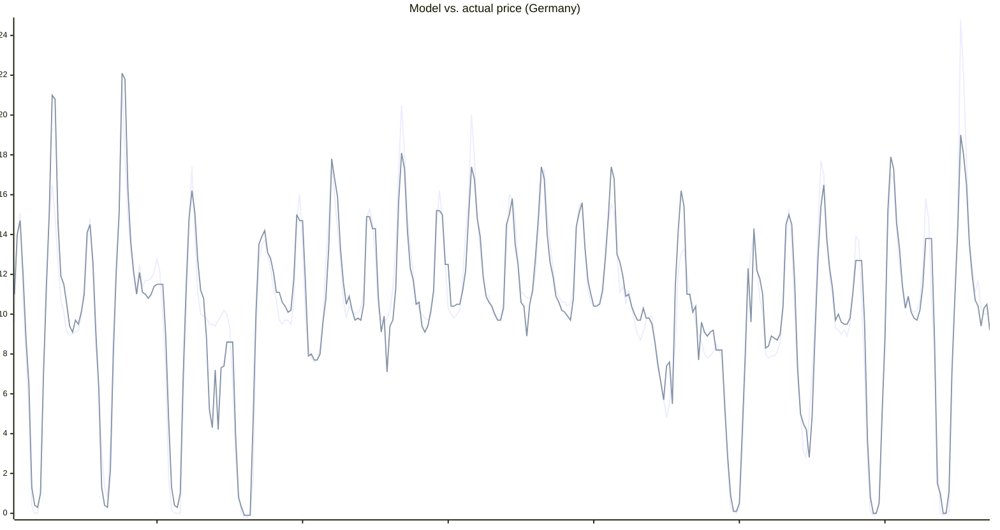

# EPEX day-ahead price prediction

This is a simple statistical model to predict EPEX day-ahead prices based on various parameters.
It works to a reasonably good degree. Better than many of the commercial solutions.
This repository includes
- The self-training prediction model itself
- A simple FastAPI app to get a REST API up
- A Docker compose file to have it running wherever

Supported Countries:
- Germany (default)
- Austria


## Lookout
- Maybe package it directly as a Home Assistant Add-on

## The Model
We sample a few sample points all over the country and fetch hourly [Weather data from Open-Meteo.com](https://open-meteo.com/) for those for the past n days (default n=90).
This serves as the main data source.


Parameters:

- Wind for each location
- Temperature for each location
- Expected solar irradiance for each location
- Hour of day
- Day of the week from monday to saturday
- Whether it is a Holiday/Sunday

Output:
- Electricity price

## How it works
- First, we create a simple multi-linear-regression to get an idea how important each of
the training parameters is.
- This alone is not enough, because electricity prices are not linear.
E.g. low wind&solar leads to gas power plants being turned on, and due to merit order pricing, electricity prices explode.
- Therefore, we then multiply each parameter with its weight (LinReg factor) to get a "normalized" data set.
- In the next step, we use a KNN (k=3) approach to find hours in the past with similar properties and use that to determine the final price.

## Model performance
For performance testing, we used historical weather data with a 90%/10% split for a training/testing data set. See `predictor/model/performance_testing.py`.

Results:\
DE: Mean squared error ~4.5 ct/kWh, mean absolute error ~1.46 ct/kWh\
AT: Mean squared error ~6.56 ct/kWh, mean absolute error ~1.74 ct/kWh

Some observations:
- At night, predictions are usually within 1-2ct/kWh
- Morning/Evening peaks are usually within 3-4ct/kWh
- Extreme peaks due to "Dunkelflaute" are correctly detected, but estimation of the exact price is a challange. E.g.
the model might predict 75ct, while in reality it's only 60ct or vice versa
- High PV noons are usually correctly detected. Sometimes it will return 3ct instead of -1ct, but the ballpark is usually correct.

This graph compares the actual prices to the ones returned by the model for a random two week time period in early 2025.

Note that this was created for a time range in the past with historic weather data, rather than forecasted weather data,
so actual performance might be a bit worse if the weather forecast is not correct.




# Public API
You can find a freely accessible installment of this software [here](https://epexpredictor.batzill.com/).
Get a glimpse of the current prediction [here](https://epexpredictor.batzill.com/prices).

There are no guarantees given whatsoever - it might work for you or not.
I might stop or block this service at any time. Fair use is expected!

# Home Assistant integration
At some point, I might create a HA addon to run everything locally.
For now, you have to either use my server, or run it yourself.


### Configuration:
```yaml
# Make sure you change the parameters fixedPrice and taxPercent according to your electricity plan
sensor:
  - platform: rest
    resource: "https://epexpredictor.batzill.com/prices?country=DE&fixedPrice=13.15&taxPercent=19"
    method: GET
    unique_id: epex_price_prediction
    name: "EPEX Price Prediction"
    scan_interval: 500
    unit_of_measurement: ct/kWh
    value_template: "{{ value_json.prices[0].total }}"
    json_attributes:
      - prices

  # If you want to evaluate performance in real time, you can add another sensor like this
  # and plot it in the same diagram as the actual prediction sensor

  #- platform: rest
  #  resource: "https://epexpredictor.batzill.com/prices?country=DE&fixedPrice=13.15&taxPercent=19&#evaluation=true"
  #  method: GET
  #  unique_id: epex_price_prediction_evaluation
  #  scan_interval: 3600
  #  name: "EPEX Price Prediction Evaluation"
  #  unit_of_measurement: ct/kWh
  #  value_template: "{{ value_json.prices[0].total }}"
  #  json_attributes:
  #    - prices
```

### Display, e.g. via Plotly Graph Card:
```yaml
type: custom:plotly-graph
time_offset: 26h
layout:
  yaxis9:
    fixedrange: true
    visible: false
    minallowed: 0
    maxallowed: 1
entities:
  - entity: sensor.epex_price_prediction
    name: EPEX Price History
    unit_of_measurement: ct/kWh
    texttemplate: "%{y:.0f}"
    mode: lines+text
    textposition: top right
  - entity: sensor.epex_price_prediction
    attribute: dummy
    name: EPEX Price Prediction
    unit_of_measurement: ct/kWh
    texttemplate: "%{y:.0f}"
    mode: lines+text
    textposition: top right
    filters:
      - fn: |-
          ({meta}) => ({
              xs: meta.prices.map(p => new Date(p.startsAt)),
              ys: meta.prices.map(p => p.total)
          })
  - entity: ""
    name: Now
    yaxis: y9
    showlegend: false
    line:
      width: 1
      dash: dot
      color: orange
    x: $ex [Date.now(), Date.now()]
    "y":
      - 0
      - 1
hours_to_show: 30
refresh_interval: 10
```
